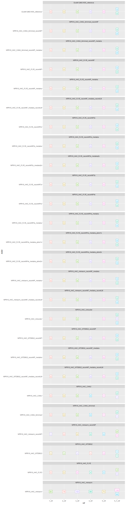

README
================
Rasmus Kirkegaard
22 September, 2020

# Ecoli benchmarks

**Objective:** Test if R10.3 data can produce nanopore only assemblies
with an indel error rate on par with that of the hybrid approach

**Strategy:** Use E. Coli K12 MG1655 reference strain data to produce a
set assemblies and evaluate these with different assembly metrics in
comparison to the “true” reference

# Assembly comparison for Ecoli K12MG1655 using R10.3 data guppy v. 4.0.1.14 HAC

Hoping to some day produce nanopore only assemblies it is important to
assess different assembly and polishing strategies whenever there is a
major update. The release of R10.3 pores promised to improve errors in
homopolymers and thus represent a major update. As an example E coli
K12MG1655 is used as it is expected to have a pretty good reference
assembly for comparison.

## Conclusion

The best indel rate for a nanopore only assembly is 1.19/100kb which is
pretty amazing\!\!\! And we get perfect 16S sequences\!\!\!

## Sorted by ANI

<!-- -->

## Sorted by indelrate

<!-- -->

## Sorted by mismatch rate

<!-- -->

# Will short read polishing ruin true differences in repeats?

For multicopy genes with high similarity but not necessarily identical
copies such as the 16S rRNA gene there is a risk that polishing with
short reads will average out true differences and produce a chimeric
consensus. This would be the result of reads not spanning the repeat
region and thus mapping randomly. However, if there is just enough
correct sequence to allow short reads to map better to a different
location this would not be a problem and truly identical copies will
still be identical. Another risk with polishing is that a repeat region
contains a drastic error in the first place and thus never recruits any
reads to polish the section as the reads preferentially map to one of
the other copies. The reference genome has 7 copies of the 16S rRNA
gene, two of which are identical and others with up to 15 mismatches.

<!-- -->

## Dependencies

### Data

  - \~50x worth of R10.3 guppy w. high accuracy mode (own production)
  - \~50x worth of Illumina from:
    [SRR2627175](https://www.ebi.ac.uk/ena/data/view/SRR2627175)
  - Reference assembly:
    [U00096.2](https://www.ncbi.nlm.nih.gov/nuccore/U00096.2)

### Assemblers:

  - [CANU (v. 2.0)](https://github.com/marbl/canu)
  - [miniasm (v. 0.3)](https://github.com/lh3/miniasm)
  - [FLYE (v. 2.6)](https://github.com/fenderglass/Flye)
  - [WTDBG2 (v. 2.4)](https://github.com/ruanjue/wtdbg2)
  - [Unicycler (v. 0.4.6)](https://github.com/rrwick/Unicycler)

### Polishing tools:

  - [Medaka (v. 1.0.1)](https://github.com/nanoporetech/medaka)
  - [racon (v. 1.3.3)](https://github.com/isovic/racon)
  - [pilon (v. 1.23)](https://github.com/broadinstitute/pilon)

### QC

  - [CheckM (v. 1.1.2)](https://ecogenomics.github.io/CheckM/)
  - [fastANI (v. 1.2)](https://github.com/ParBLiSS/FastANI)
  - [Barrnap (v. 0.9)](https://github.com/tseemann/barrnap)
  - [usearch (v. 11)](https://www.drive5.com/usearch/)
  - [QUAST (v. 4.6.3)](http://quast.sourceforge.net/)
  - [PROKKA (v. 1.14)](https://github.com/tseemann/prokka/)

### Misc.

  - [minimap2 (v. 2.15)](https://github.com/lh3/minimap2)
  - [samtools (v. 1.10)](http://www.htslib.org/)
  - R version 4.0.0 (2020-04-24)
      - tidyverse (v. 1.3.0)
      - data.table (v. 1.12.8)
      - rmarkdown (v. 2.1)

# My computer

    ## R version 4.0.0 (2020-04-24)
    ## Platform: x86_64-w64-mingw32/x64 (64-bit)
    ## Running under: Windows 10 x64 (build 19041)
    ## 
    ## Matrix products: default
    ## 
    ## locale:
    ## [1] LC_COLLATE=English_United Kingdom.1252 
    ## [2] LC_CTYPE=English_United Kingdom.1252   
    ## [3] LC_MONETARY=English_United Kingdom.1252
    ## [4] LC_NUMERIC=C                           
    ## [5] LC_TIME=English_United Kingdom.1252    
    ## 
    ## attached base packages:
    ## [1] stats     graphics  grDevices utils     datasets  methods   base     
    ## 
    ## other attached packages:
    ## [1] forcats_0.5.0 ggrepel_0.8.2 gridExtra_2.3 dplyr_0.8.5   ggplot2_3.3.0
    ## 
    ## loaded via a namespace (and not attached):
    ##  [1] Rcpp_1.0.4.6     knitr_1.28       magrittr_1.5     tidyselect_1.1.0
    ##  [5] munsell_0.5.0    colorspace_1.4-1 R6_2.4.1         rlang_0.4.6     
    ##  [9] stringr_1.4.0    tools_4.0.0      grid_4.0.0       gtable_0.3.0    
    ## [13] xfun_0.14        withr_2.2.0      htmltools_0.4.0  ellipsis_0.3.1  
    ## [17] assertthat_0.2.1 yaml_2.2.1       digest_0.6.25    tibble_3.0.1    
    ## [21] lifecycle_0.2.0  crayon_1.3.4     farver_2.0.3     purrr_0.3.4     
    ## [25] vctrs_0.3.0      glue_1.4.1       evaluate_0.14    rmarkdown_2.1   
    ## [29] stringi_1.4.6    compiler_4.0.0   pillar_1.4.4     scales_1.1.1    
    ## [33] pkgconfig_2.0.3
